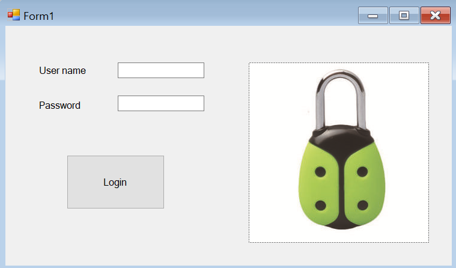
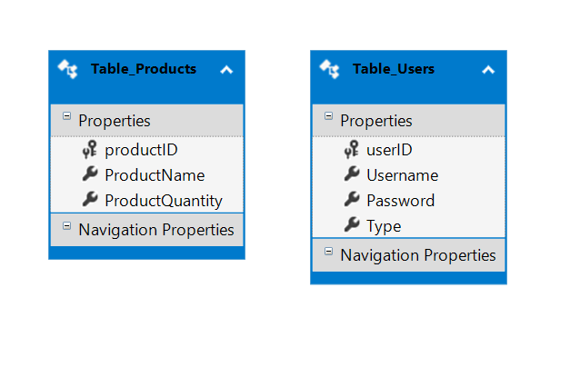

# SQLServer_MagazinFructe_CSharp

# User Interface Design

# Description
- I used my SQLServer_MagazinFructe project -> where I first created the database with two tables (Table_Users, Table_Products);
- then I used Entity Framework in this project (called SQLServer_MagazinFructe_CSharp), which generates a class based on each table;

- this project is built in Windows Forms App (.NET Framework), Visual Studio 2019, which imports my database;
- I used Entity Framework (EF) Designer because I already have a database (SQLServer_MagazinFructe project).
